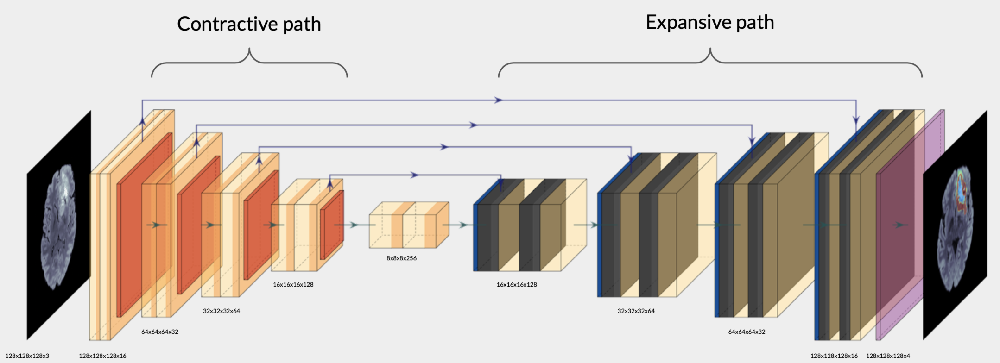

# Segmentation


## Abstract

In this <a href="/ressources/TumorSeg.pdf" target="_blank" type="application/pdf">paper</a>, presented a brain tumor segmentation method using deep learning. A tumor can appear anywhere in the brain, it can take different shape, size and contrast. That is why the use of the different sequences in MRI techniques will be exploited to benefit the segmentation. By extracting the most important features from the MRIs inputs a corresponding segmentation will be generated. To do so, we can distinguish 2 path in the neural network the first one, called contracting path which will be dedicated to extract important and useful information. And the second one the expansive path that will, based on the information extracted, predict the segmentation of the tumor.

## Introduction

In this repo you will find any code that was necessary to achieve the segmentation of a brain tumor.
From displaying any type of brain MRI data, to processing it.
Furthermore you will find the code of the model used.
A small notebook will be included to walk through the code and show an exemple of how it could be used using the **[BraTS2020 Dataset (Training + Validation)](https://www.kaggle.com/datasets/awsaf49/brats20-dataset-training-validation)** dataset.

## Model


## Exemple

In the [notebook](main.ipynb) you will find an exemple of how to train a neural network to perform segmentation.
Before going into it, make sure to have your [Kaggle API]((https://www.kaggle.com/docs/api)) key at hand.

## [Demo](demo)
## Logs

[Logs](logs) were stored using a tensorboard callback during the training.

To launch the tensorboard instance run

``` tensorboard --logdir='log' ```

It will give a view on the evolution of the loss, the F1Score also known as the Dice Coefficient and the IOUScore. For both the training and validation data.