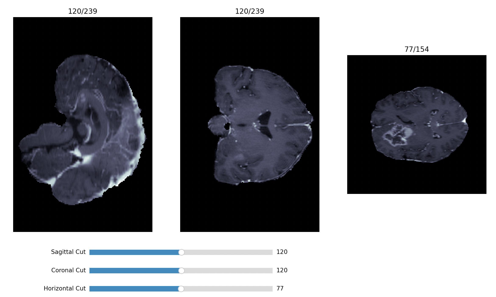
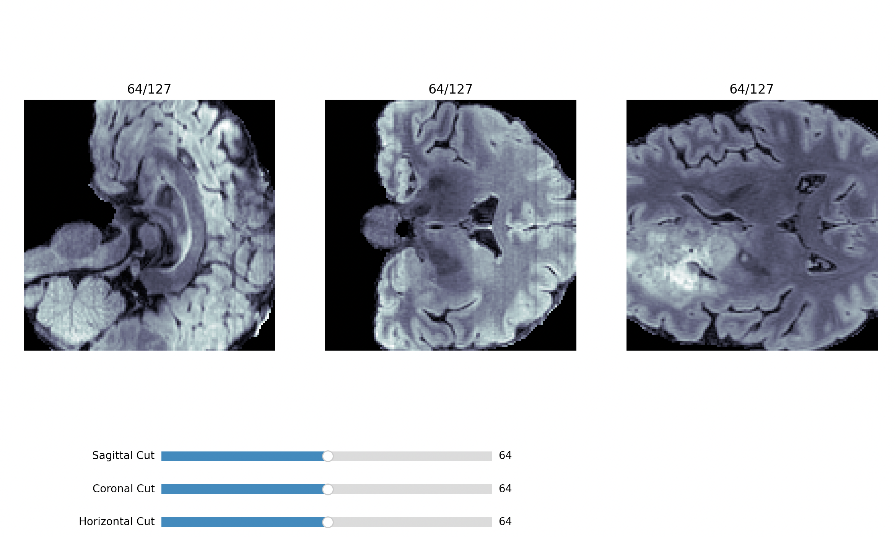
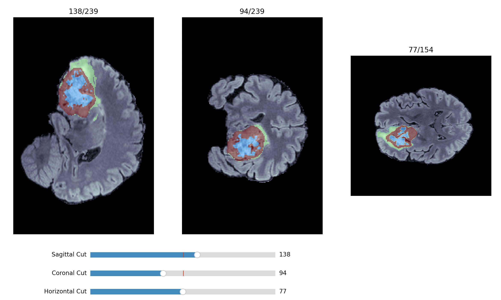

# Demo

In this folder you'll find the demos used to present the project in front of a jury. 
(unfortunatly for legal perposes MRIs can't be made available in this repo)

### [00_demo](00_demo.py)
Displays the raw brain data in 3D using the display functions, then the processed brain data. And finaly after calling for a prediction by the model it displays the raw brain data with the corresponding predicted mask.

<table>
  <tr>
    <td></td>
    <td></td>
    <td></td>
  </tr>
</table>

### [01_demo](01_demo.py)
After processsing and getting a prediction by the model.
A display comparing the ground thruth to the prediction will give an idea of the model's accuracy.

### [display_demo](display_demo.py)
Exemples of how the display functions are used